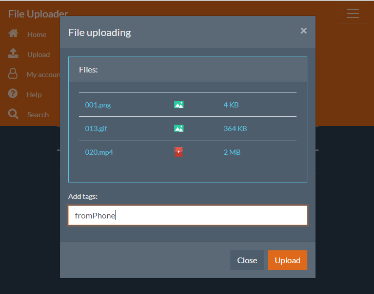

# FileUploaderClient



## Installation of dependencies

```
yarn
```

## Running development server

```
yarn start
```

## Building the application

```
yarn build
```

## Running unit tests

```
yarn test
```
